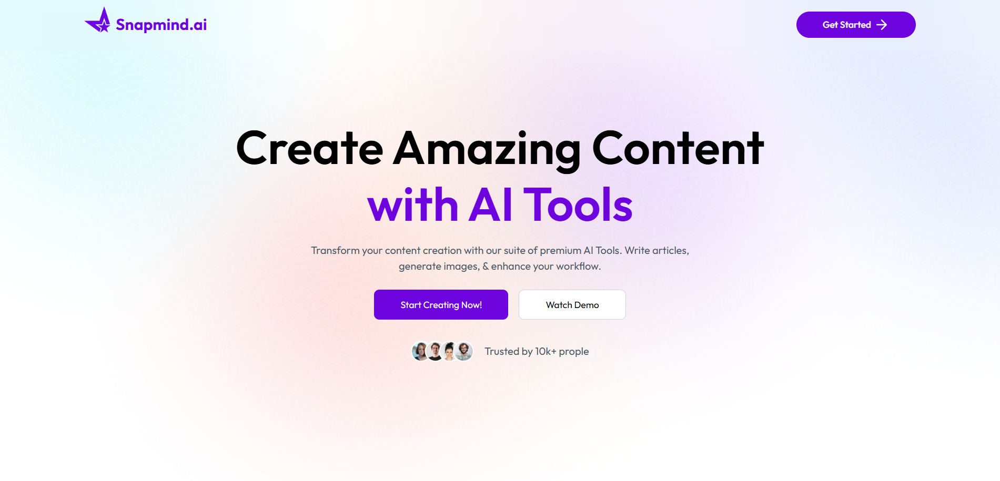
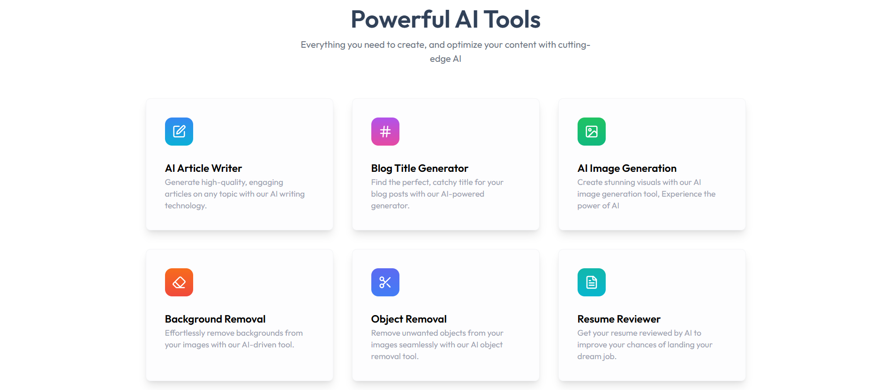
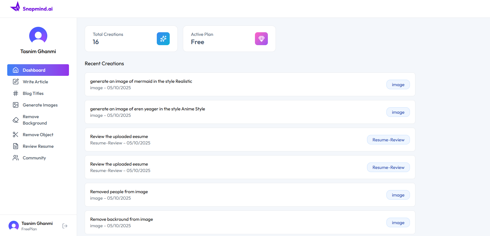
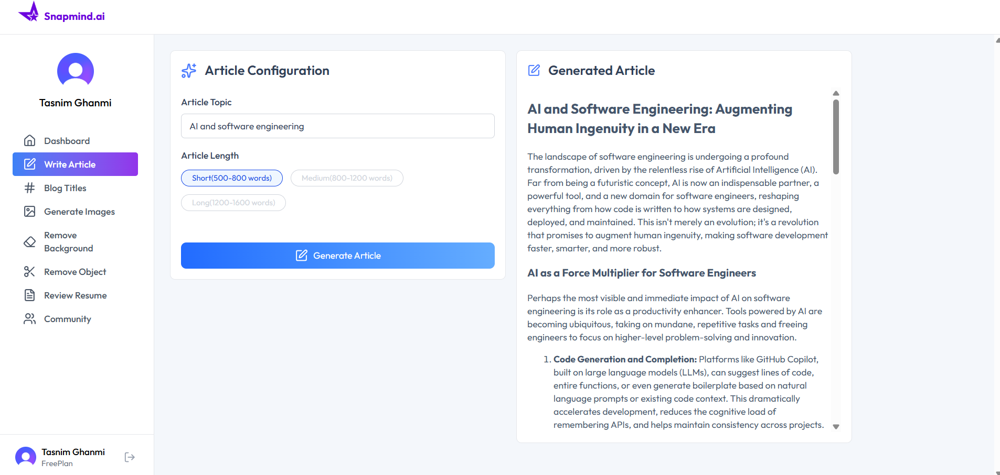
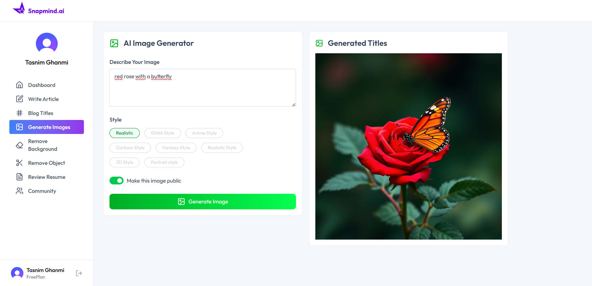
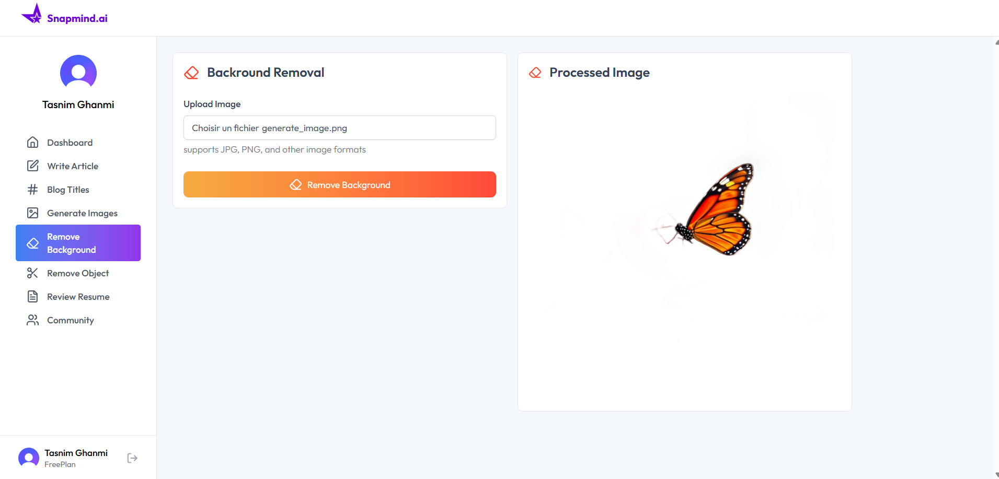
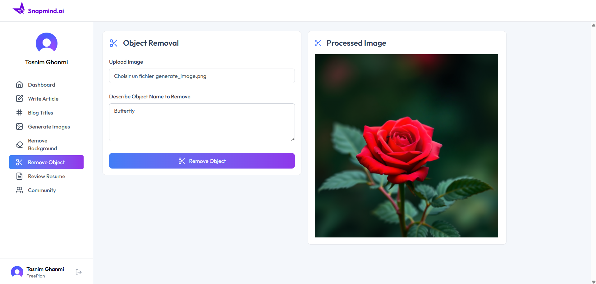
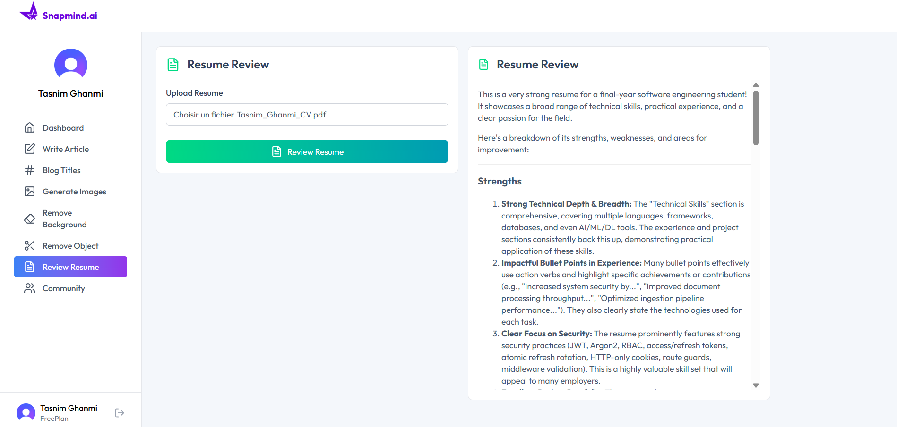
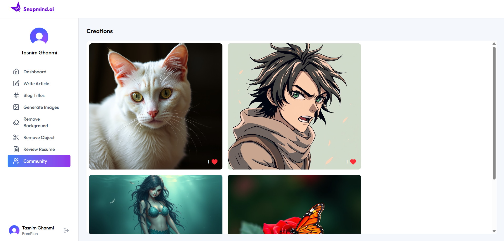
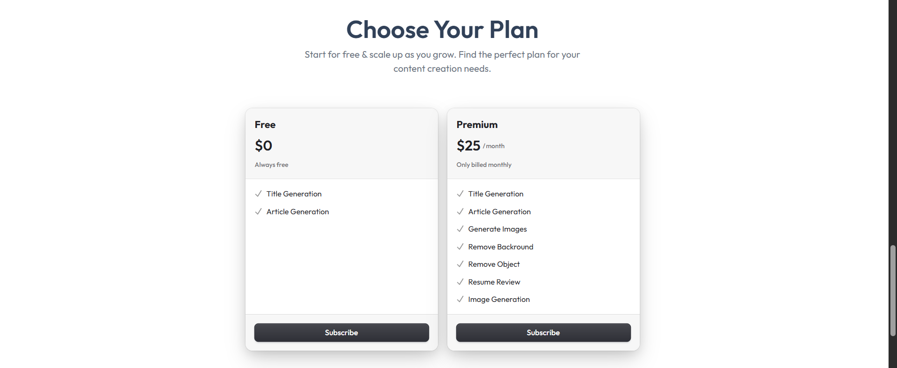

# Snapmind.ai — AI-Powered SaaS Platform

  

> **Create Amazing Content with AI Tools** — A full-stack SaaS platform that empowers creators with cutting-edge AI features for writing, image generation, and more.

---

## 📋 Table of Contents

- [Overview](#overview)
- [Features](#features)
- [Tech Stack](#tech-stack)
- [Screenshots](#screenshots)

---

## Overview

Snapmind.ai is a full-stack, AI-powered SaaS platform built with the **PERN stack** (PostgreSQL, Express, React, Node.js). It provides a suite of premium AI tools for content creators — from writing articles and generating images to reviewing resumes and removing image backgrounds/objects.

Snapmind.ai offers a free tier and a premium subscription, with a seamless dashboard to track all your creations.

---

## ✨ Features

### AI Tools

| Tool | Description |
|------|-------------|
| ✍️ **AI Article Writer** | Generate high-quality, engaging articles on any topic with configurable length (500–1600 words) |
| # **Blog Title Generator** | Find the perfect, catchy title for your blog posts using AI |
| 🖼️ **AI Image Generation** | Create stunning visuals in styles like Realistic, Anime, Ghibli, Fantasy, 3D, and more |
| 🔳 **Background Removal** | Effortlessly remove backgrounds from images using AI |
| ✂️ **Object Removal** | Remove unwanted objects from images by simply describing them |
| 📄 **Resume Reviewer** | Upload your resume and get AI-powered feedback on strengths, weaknesses, and improvements |

### Platform Features

- 🔐 **Secure Authentication** — Sign in with Google or email/password via Clerk
- 👤 **Profile Management** — Manage account info, email addresses, and connected accounts
- 🛡️ **Role-Based Access Control** — Free and Premium plan feature gating
- 💳 **Subscription Billing** — Free ($0) and Premium ($25/month) plans
- 📊 **Interactive Dashboard** — Track total creations, active plan, and recent activity
- 🌐 **Community Gallery** — Browse and like publicly shared AI-generated images
- ☁️ **Cloudinary Integration** — Optimized image storage and delivery

---

## 🛠️ Tech Stack

**Frontend:**
- React.js
- Tailwind 
- Responsive UI (mobile-friendly)
- Clerk (authentication & user management)

**Backend:**
- Node.js + Express.js
- RESTful API architecture

**Database:**
- PostgreSQL (serverless, powered by **Neon**)

**AI & Integrations:**
- AI article & title generation (LLM-powered)
- AI image generation (multi-style)
- Background & object removal APIs
- Resume analysis AI
- **Cloudinary** for image asset management

---

## 📸 Screenshots

Landing Page

AI Tools Overview

Dashboard

Write Article

AI Image Generation

Background Removal

Object Removal

Resume Review

Community Gallery

Pricing Plans

---

  Built with ❤️ by <strong>Tasnim Ghanmi</strong>

